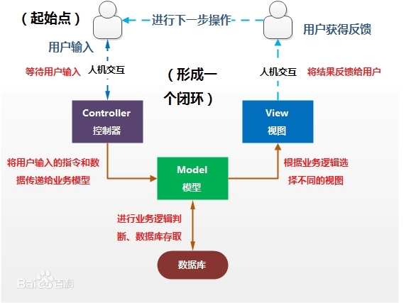
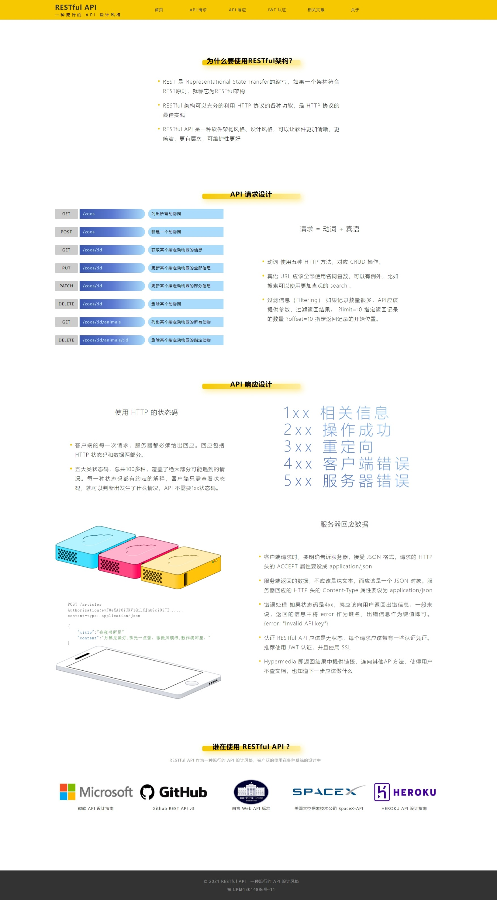
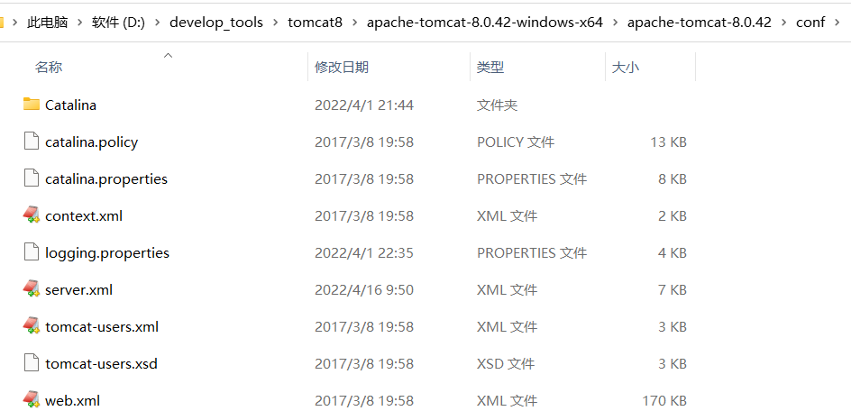
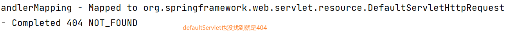
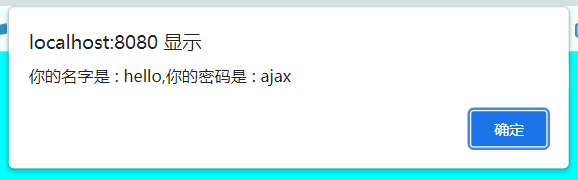
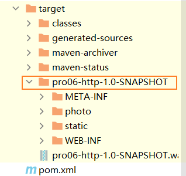
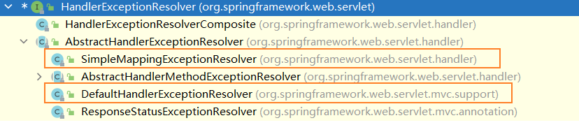
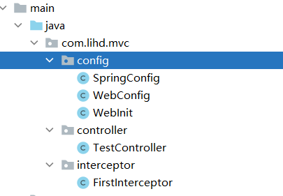

# SpringMVC

##  引入

#### 0 学习路线

javaSE -> javaWeb -> ssm -> ssm项目 -> 
spring + springmvc + mybatis

#### 1 使用maven


#### 2 什么是mvc
- M model 模型
-  V view 视图
- C Controller 控制器
  


#### 3 SpringMVC的简介

#### 4 SpringMVC的特点

## HelloWorld


## @RequestMapping注解


## SpringMVC获取请求参数


## 域对象共享数据


## SpringMVC的视图


## RESTFul



## RESTFul案例
#### 56 57 搭建rest环境
其中没有service层 dao层也是假数据  
这样做的目的是我们学习什么就应该主要关注什么。聚焦学习。

#### 58 59 thymeleaf展示 rest数据
注意 th语法 下面是正确格式  
```html
1 中间用 ：  
th:each="emp : ${empList}"  
2 一对||可以把该解析的解析了而不是当做字符串 肥肠的好用  
th:text="@{|/emp/${emp.id}|}"
3 在vue中遍历的格式 使用in  
"emp in empList"
```
#### 60 实现删除功能
1. 设置表单 method = post 隐藏域 name = _method value = delete
2. 在webapp下建立static模块资源 放入vue文件
3. 在<body>下面放入 script 完成代码
4. 重定向到 employee 注意重定向是get请求
5. 目前的post请求只有表达method=post和ajax才能实现 其他全部是get请求
6. DefaultServlet学习一下 这东西确实没学过
7. 在springMVC.xml中配置默认Servlet <mvc:default-servlet-handler/>

#### 61 添加功能
添加需要到一个页面去添加 到这个页面的过程不满足 rest(不可避免)
而到这个页面提交的时候 地址栏是emp满足rest

#### 62 63 修改功能
1. 表单中的checked属性
2. 表单中的field属性
3. 修改包括 查询一条数据（回显数据） 和 修改一条数据两个模块
4. 修改功能可以做到 全部满足rest
5. 第一步 查询一条数据 /emp/id get请求
6. 第二步 提交 /emp put请求 

#### 64 defaultServlet
首先找到这里 打开web.xml 
这里的web.xml和我们工程里的xml类似于父类和子类的关系
当发生冲突时 采用就近原则 


```xml
<!-- 103 -->
<servlet>
        <servlet-name>default</servlet-name>
        <servlet-class>org.apache.catalina.servlets.DefaultServlet</servlet-class>
        <init-param>
            <param-name>debug</param-name>
            <param-value>0</param-value>
        </init-param>
        <init-param>
            <param-name>listings</param-name>
            <param-value>false</param-value>
        </init-param>
        <load-on-startup>1</load-on-startup>
    </servlet>
    
    <!-- 385行 -->
    <!-- The mapping for the default servlet -->
    <servlet-mapping>
        <servlet-name>default</servlet-name>
        <url-pattern>/</url-pattern>
    </servlet-mapping>

    <!-- The mappings for the JSP servlet -->
    <servlet-mapping>
        <servlet-name>jsp</servlet-name>
        <url-pattern>*.jsp</url-pattern>
        <url-pattern>*.jspx</url-pattern>
    </servlet-mapping>
```

DefaultSrvlet可以帮助我们处理 静态资源 如果 DispatcherServlet处理不了 就会使用DefaultServlet

不过要求
```xml
<!--    这里是 开启视图控制器 如果一个controller方法不进行任何操作只进行渲染thyemleaf标签-->
<!-- 那么就可以采用 这种方式 但是如果只配置这种方式会导致 ： 所有的Controller方法失效 -->
<!-- 解决方法 ： 开启注解驱动 那么Controller方法就不会失效 -->
    <mvc:view-controller path="/" view-name="index"/>
    <mvc:view-controller path="/addEmp" view-name="employee_add"/>

<!--这一行可以让DispatcherServlet生效 如果不配置这一行 只配置defaultServlet 会导致所有的请求都是-->
<!--由DeafaultServlet处理的 -->
<!--这一行也可以让上面开启视图控制器 失效的所有Controller重新生效-->
    <mvc:annotation-driven/>
<!--这一行可以 使defaultServlet重新生效 因为DispatcherServlet和DefaultServlet的访问路径都是 “/”-->
<!--安装就近原则 tomcat下配置的默认的DefaultServlet就会失效-->
<!--配置这一行后 两者就不会冲突 都可以执行-->
<!--执行顺序 请求 -> DispatcherServlet -> DefaultServlet -> 404-->
<!--意思是一个请求先被DispatcherServlet处理 没有找到会被DefaultServlet处理 还没找就是404-->
<!--如果有一个请求可以被servlet处理就不会向下执行-->
    <mvc:default-servlet-handler/>
<!--如果我们没有配置 log日志文件 如果DispacherServlet没有找到会在控制台报404-->
<!--而 DefaultServlet没有找到不会在控制台输出任何提示信息-->
<!--因此这也说明log日志对服务器的重要性--> 
```


## HttpMessageConverter
HttpMessageConverter，报文信息转换器，将请求报文转换为Java对象，或将Java对象转换为响应报文
HttpMessageConverter提供了两个注解和两个类型：  
（表格这要留一个空行好像）

|请求|响应|
|--- |---|
|@RequestBody| @ResponseBody|
|RequestEntity|ResponseEntity|
#### 65 引入
比较常用的是 响应
因为我们在之前的学习中可以很方便的获取请求参数 请求头 cookie等
甚至可以很方便的封装一个对象  
但是我们处理响应体就非常麻烦 需要response.getWriter
writer.writer(xx) 比较麻烦
#### 66 67 @RequestBody RequestEntity
其中requestBody只包含响应体
1. requestEntity包含全部信息
2. requestEntity.getHeaders()获取请求头
3. requestEntity.getBody()获取请求体
**请求头中比较重要的**
4. host 主机信息应该是 客户端的主机 
5. user-agent 里面有浏览器信息 可以根据浏览器的不同进行不同的处理
6. referer 存放了访问路径这个里面可以有分页信息 根据这个值实现分页比较方便
7. cookie 存放了客户端的数据

```text
//这里是一次请求中的请求头信息 还是很丰富的
headers = [host:"localhost:8080", connection:"keep-alive", content-length:"40", 
cache-control:"max-age=0", sec-ch-ua:"" Not;A Brand";v="99", 
"Google Chrome";v="97", "Chromium";v="97"", sec-ch-ua-mobile:"?0", 
sec-ch-ua-platform:""Windows"", upgrade-insecure-requests:"1", 
origin:"http://localhost:8080",
user-agent:"Mozilla/5.0 (Windows NT 10.0; Win64; x64) AppleWebKit/537.36 (KHTML, like Gecko) Chrome/97.0.4692.99 Safari/537.36", accept:"text/html,application/xhtml+xml,application/xml;q=0.9,image/avif,image/webp,image/apng,*/*;q=0.8,application/signed-exchange;v=b3;q=0.9", 
sec-fetch-site:"same-origin", sec-fetch-mode:"navigate", sec-fetch-user:"?1", sec-fetch-dest:"document",
 referer:"http://localhost:8080/pro06/", 
 accept-encoding:"gzip, deflate, br", accept-language:"zh-CN,zh;q=0.9", 
 cookie:"Idea-8296e770=aba0359c-6458-40f9-b16a-e0d9b0b11e4c; Idea-8296eb32=d570dd70-cff2-486a-9260-5e3146c13392; UM_distinctid=17fa1657c621ee-0d8b633f2f6c4-f791539-144000-17fa1657c633f6; CNZZDATA5175564=cnzz_eid%3D767437561-1647677703-%26ntime%3D1647677703; 53revisit=1647680257636; Webstorm-be5713b6=898c4643-6a23-488e-ab61-a648477d7bc4", Content-Type:"application/x-www-form-urlencoded;charset=UTF-8"]

```

#### 68 HttpServletResponse 原生api响应字符串
之前响应有两种
1 返回完整的页面 转发 或重定向
2 getWriter writer.write()
3. getWriter.write() 或者 getWriter.print()本质是什么？   
   **就是在写或者打印响应体 ！ 之前的一个页面也是作为一个响应体出现的**
4. 如果控制方法通过传入response 使用了 getWriter()控制器中的方法可以是 void返回值 也可以是String返回null


#### 69 @ResponseBody 响应字符串
在方法上加上@ResponseBody返回值是String就可以把返回值作为请求体返回

#### 70  @ResponseBody 响应Json
> 注意浏览器不会认识javaBean也不认识你服务器用什么编程语言
> 他只接收字符串 因此返回的javaBean肯定要通过某种方式转换为字符串
分为四步
* 第一步导入依赖
```xml
<dependency>
    <groupId>com.fasterxml.jackson.core</groupId>
    <artifactId>jackson-databind</artifactId>
    <version>2.12.1</version>
</dependency> 
```
* 第二步开启注解驱动
```xml
<mvc:annotation-driven/>
这是此注解的第三种功能
1 在配置了mcv:controller-view时其他requestMapping重新生效
2 在配置了<mvc:default-servlet-handler/>后使 DispatcherServlet重新生效
3 自动装配 MappingJackson2HttpMessageConverter 将控制器中返回javaBean对象的方法封装为json字符串
```
* 第三步在控制器方法上使用@ResponseBody
* 第四步返回javaBean
```java
@RequestMapping("testResponseBean")
    @ResponseBody
    public User testResponseBean(){
        return new User(1001, "李白", "太白");
    }
```
结果是一个Json字符  


#### 71 json复习

Json是JavaScript一种数据类型
数据交互格式 xml json
xml多作用于配置文件 格式严谨清晰
json作为交互格式（传输字符串数据）比较多 数据结构简单 解析简单 数据量小
dom4j解析xml比较麻烦

json三个知识点
1 如何解析json
2 区分json对象{}和json数组[]
3 与java对象的互相转换
    map - 对象
    bean - 对象
    list - 数组

#### 72 @ResponseBody处理 Ajax
处理前端总是出错 以后我他妈一定把前端全学了 可恶
过程不多说了 都在下面
```html
<h4 id="app"><a  @click="sendAjax"  th:href="@{/testResponseAjax}">测试ResponseBody返回Ajax</a></h4>


    <script type="text/javascript" th:src="@{static/js/vue.js}"></script>
    <script type="text/javascript" th:src="@{static/js/axios.min.js}"></script>

    <script type="text/javascript">

        let vue = new Vue({
            el:"#app",
            methods:{
                sendAjax:function (event){
                    axios({
                        method:"post",
                        url:event.target.href,
                        params:{
                            username:"hello",
                            password:"ajax"
                        }
                    }).then(function (response){
                        alert(response.data)
                    }).catch(function (reason){
                        alert(reason);
                    })

                    event.preventDefault();
                }
            }

        })

    </script>
```
```java
@RequestMapping("/testResponseAjax")
    @ResponseBody
    public String testResponseAjax(String username,String password){
        System.out.println("守护最好的AJAX");
        return "你的名字是 : "+username + ",你的密码是 : " + password;
    }
```

---



#### 73 @RestController注解

@RestController注解是springMVC提供的一个复合注解，标识在控制器的类上，  
就相当于为类添加了@Controller注解，并且为其中的每个方法添加了@ResponseBody注解

这个注解和上面的@ResponseBody注解以后会经常用到！
学习了SpringBoot后 我们将进入一个微服务世界中 把一个大项目拆解为一个一个单独的小项目
项目中的通信使用json这就意味着 我们需要使用上面的两个注解

#### 74 ResponseEntity 文件下载 
格式是非常固定的 能改的只有 filepath 和 filename  
这里注意两点 ：
1. is.available()获取InputStream的长度
2. 下载的头信息 "Content-Disposition", "attachment;filename="+filename 注意attachment的意思是以附件形式下载
3. new ResponseEntity<>(bytes, headers, statusCode); 分别对应响应体 响应头 响应状态码
```java
@RequestMapping("/downloadFile")
    public ResponseEntity<byte[]> testResponseEntity(HttpSession session,String filename,String filepath) throws IOException {
        //获取ServletContext对象
        ServletContext servletContext = session.getServletContext();
        //获取服务器中文件的真实路径
//        String realPath = servletContext.getRealPath("/static/img/"+filename);
        String realPath = servletContext.getRealPath(filepath+filename);
        //创建输入流
        InputStream is = new FileInputStream(realPath);
        //创建字节数组
        byte[] bytes = new byte[is.available()];
        //将流读到字节数组中
        is.read(bytes);
        //创建HttpHeaders对象设置响应头信息
        MultiValueMap<String, String> headers = new HttpHeaders();
        //设置要下载方式以及下载文件的名字
        headers.add("Content-Disposition", "attachment;filename="+filename);
        //设置响应状态码
        HttpStatus statusCode = HttpStatus.OK;
        //创建ResponseEntity对象
        ResponseEntity<byte[]> responseEntity = new ResponseEntity<>(bytes, headers, statusCode);
        //关闭输入流
        is.close();
        return responseEntity;
    }
```

#### 75 76 实现上传功能 
一个jar包  下载用不到 上传要用到
第一步 添加maven依赖
```xml
<!-- https://mvnrepository.com/artifact/commons-fileupload/commons-fileupload -->
<dependency>
    <groupId>commons-fileupload</groupId>
    <artifactId>commons-fileupload</artifactId>
    <version>1.3.1</version>
</dependency>
```
第二步 在springMVC.xml文件中配置  
MultipartResolver是一个接口 实现类有：CommonsMultipartResolver
> 这里很神奇 是通过getId()而不是getType()获取的
> 如果没有设置id或者设置的id不是 multipartResolver待会都有问题
```xml
    <bean id="multipartResolver" class="org.springframework.web.multipart.commons.CommonsMultipartResolver"/>
```

第三步 设置表单    
注意 ：方法是post并且要求设置enctype="multipart/form-data"其含义为二进制类型  
如果不写默认是enctype="application/x-www-form-urlencoded"
```html

<form th:action="@{/uploadFile}"  method="post" enctype="multipart/form-data">
    <input type="file" name="photo">
    <input type="submit" value="上传">
</form>
```

第四步 设置控制器方法  
核心的方法：  
MultipartFile.getOriginalFilename()获取文件名  
MultipartFile.transferTo()将一个流转换为另一流（java10新特性 谁好我抄谁）  
注意获取session是为了获取application然后 得到绝对路径   
这里的绝对路径对应在这 （区别于javaweb项目 的out目录）   
如果没有文件记得去创建 文件分割符最好使用File.separator  

```java
@RequestMapping("/uploadFile")
    public String uploadFile(MultipartFile photo, HttpSession session) throws IOException {
        MultipartResolver multipartResolver;
        String name = photo.getName();
        String filename = photo.getOriginalFilename();
        System.out.println("name = " + name);
        System.out.println("filename = " + filename);

        ServletContext application = session.getServletContext();
        String photoPath = application.getRealPath("photo");

        File file = new File(photoPath);
        if(!file.exists()){
            file.mkdir();
        }

        String finalPath = photoPath + File.separator + filename;

        photo.transferTo(new File(finalPath));
        
        return "persist";
    }
```

#### 77 解决上传文件时文件重名
2022年4月18日10:36:07 
上传文件的本质是 文件的复制 
在之前的流的复制中如果目标文件不存在会创建 存在的请求下就会删除（append默认为false）  
当我们设置为true后的意思就是追加  
这就会产生文件内容的覆盖  也就是说 会产生类似于覆盖的效果
为了保证上传一定会成功 我们需要使用uuid生成一个随机数 保证我们的图片名不会重复 因此不会发生覆盖  
在上面的基础上进行修改 保证我们生成的文件名不会重复  
1 生成随机uuid ：UUID.randomUUID().toString();  
2 获取文件后缀名(带点)：xxx.subString(xxx.lastIndexOf('.'))
```java
//生成uuid的文件名 保证不会重复
        String uuid = UUID.randomUUID().toString();
        String suffix = filename.substring(filename.lastIndexOf('.'));

        filename = uuid + suffix;
```
## 拦截器
#### 78 拦截器介绍
三个方法 
preHandle 执行控制器方法之前执行  
postHandle 执行控制器方法之后执行  
afterCompletion 视图渲染完成之后执行  
#### 79 拦截器环境搭建
1 重写 HandlerInterceptorAdapter（已经过时）  
2 实现 HandlerInterceptor 重写已经提供的三个默认方法  

#### 80 配置拦截器
1 去xml中配置  
2 /* 代表context下一层目录  
3 /** 代表所有
preHandle 返回true代表放行 返回false代表不放行
#### 81 82 观察源码
这里还是要学会设置断点啊  
主要观察以下的四个方法 
在这几个地方设置断点 就比较方便观察 
```java
public class DispatcherServlet{
    protected void doDispatch(HttpServletRequest request, HttpServletResponse response) throws Exception {
        if (!mappedHandler.applyPreHandle(processedRequest, response)) {
            return;
        }

        mv = ha.handle(processedRequest, response, mappedHandler.getHandler());

        mappedHandler.applyPostHandle(processedRequest, response, mv);

        if (mappedHandler != null) {
            // Exception (if any) is already handled..
            mappedHandler.triggerAfterCompletion(request, response, null);
        }
    }
}
```

配置文件
```xml
<mvc:interceptors>
        <ref bean="firstInterceptor"/>
        <ref bean="secondInterceptor"/>
<!--        <bean class="com.lihd.mvc.interceptor.FirstInterceptor"/>-->
<!--        <ref bean="secondInterceptor"/>-->
<!--        <mvc:interceptor>-->
<!--&lt;!&ndash;            一个*代表context下一层目录 两个*代表全部&ndash;&gt;-->
<!--            <mvc:mapping path="/**"/>-->
<!--            <mvc:exclude-mapping path="/"/>-->
<!--            <ref bean="secondInterceptor"/>-->
<!--        </mvc:interceptor>-->
    </mvc:interceptors>
```
多个拦截器执行顺序 
如果都是返回true 那么preHandle的执行顺序就是配置顺序 postHandle 和 afterCompletion的执行顺序是配置顺序的逆序
```text
FirstInterceptor.preHandle
SecondInterceptor.preHandle
SecondInterceptor.postHandle
FirstInterceptor.postHandle
SecondInterceptor.afterCompletion
FirstInterceptor.afterCompletion
```
如果有一个返回false 那么包括返回false在内的所有其之前的preHandle都会执行 postHandle没有一个会执行 
afterCompletion不包括返回false之前的所有的afterCompletion都会执行
```text
FirstInterceptor.preHandle
SecondInterceptor.preHandle
FirstInterceptor.afterCompletion
```
## 异常处理器
#### 83 引入 有两个主要的类
  
下面我们使用 SimpleMappingExceptionResolver来实现异常处理器

#### 84 使用xml文件配置
这里面也有如何配置 property属性的方法  
多看多想 留给你的时间不多了 
```xml
    <bean class="org.springframework.web.servlet.handler.SimpleMappingExceptionResolver">
        <property name="exceptionMappings">
            <props>
                <prop key="java.lang.Exception">error</prop>
            </props>
        </property>
        <property name="exceptionAttribute" value="exception"/>
    </bean>
```
#### 85 使用注解配置
需要用到两个注解
@ControllerAdvice表明这是一个异常处理组件 这个注解上面用到了@Component
@ExceptionHandler用于设置处理方法的异常  
```java
@ControllerAdvice
public class ExceptionController {

    @ExceptionHandler
    public String testExceptionHandler(Exception exception, Model model){

        model.addAttribute("exception",exception);

        return "error";
    }
}

```
## 注解配置mvc
#### 86 引入
在Servlet3.0环境中，容器会在类路径中查找实现javax.servlet.ServletContainerInitializer接口的类，如果找到的话就用它来配置Servlet容器。
Spring提供了这个接口的实现，名为SpringServletContainerInitializer，这个类反过来又会查找实现WebApplicationInitializer的类并将配置的任务交给它们来完成。
Spring3.2引入了一个便利的WebApplicationInitializer基础实现，名为AbstractAnnotationConfigDispatcherServletInitializer，
当我们的类扩展了AbstractAnnotationConfigDispatcherServletInitializer并将其部署到Servlet3.0容器的时候，容器会自动发现它，并用它来配置Servlet上下文。


项目架构 主要看config包  
SpringConfig 是 Spring的配置类  
WebConfig 是 WebConfig的配置类
WebInit 是 web.xml
  


#### 87 创建webInit类
此类对应web.xml文件 
```java
package com.lihd.mvc.config;

import org.springframework.web.filter.CharacterEncodingFilter;
import org.springframework.web.filter.HiddenHttpMethodFilter;
import org.springframework.web.servlet.support.AbstractAnnotationConfigDispatcherServletInitializer;

import javax.servlet.Filter;

/**
 * @author ：葬花吟留别1851053336@qq.com
 * @description：TODO
 * @date ：2022/4/18 19:26
 */
//目标是取代 web.xml 必须要继承AbstractAnnotationConfigDispatcherServletInitializer
public class WebInit extends AbstractAnnotationConfigDispatcherServletInitializer {

    //初始化Spring
    @Override
    protected Class<?>[] getRootConfigClasses() {
        return new Class[]{SpringConfig.class};
    }

    //初始化SpringMVC
    @Override
    protected Class<?>[] getServletConfigClasses() {
        return new Class[]{WebConfig.class};
    }

    //设置DispatcherServlet访问路径 映射规则 url-pattern
    @Override
    protected String[] getServletMappings() {
        return new String[]{"/"};
    }

    //设置过滤器
    @Override
    protected Filter[] getServletFilters() {

        CharacterEncodingFilter characterEncodingFilter = new CharacterEncodingFilter();
        characterEncodingFilter.setEncoding("UTF-8");
        characterEncodingFilter.setForceResponseEncoding(true);

        HiddenHttpMethodFilter hiddenHttpMethodFilter = new HiddenHttpMethodFilter();

        return new Filter[]{characterEncodingFilter,hiddenHttpMethodFilter};
    }
}
```


#### 88 89 创建webConfig类
webApplicationContext
@Bean通过自动装配给参数赋值

```java
package com.lihd.mvc.config;
/**
 * 1 组件扫描 context:component-scan
 * 2 视图解析器 bean:Thymeleaf 视图解析器
 * 3 视图控制器  mvc:view-controller
 * 4 注解驱动 mvc:annotation-driver
 * 5 默认servlet  mvc:default-servlet-handler
 * 6 文件上传  bean:CommonMultipartResolver
 * 7 拦截器  mvc:interceptors
 * 8 异常处理器  bean:SimpleMappingResolver
 *
 *
 * @author ：葬花吟留别1851053336@qq.com
 * @description：TODO
 * @date ：2022/4/18 19:28
 */
//0 表明是配置类
@Configuration
//1 组件扫描 context:component-scan
@ComponentScan("com.lihd.mvc")
// 4 注解驱动 mvc:annotation-driver
@EnableWebMvc
public class WebConfig implements WebMvcConfigurer {
}

```


#### 90 91 仿照之前配置文件完善webConfig类的各项功能
这里说一些要注意的吧  
文件上传方法的方法名 必须是 multipartResolver  和之前xml配置文件名必须是id必须是这个类似  
实现这个接口 WebMvcConfigurer 比较方便我们配置  
xml中的bean 对应配置类 的 @Bean  
xml中的mvc:对应这个接口中的一些方法 比较容易配置  

```java
package com.lihd.mvc.config;

import com.lihd.mvc.interceptor.FirstInterceptor;
import org.springframework.context.annotation.Bean;
import org.springframework.context.annotation.ComponentScan;
import org.springframework.context.annotation.Configuration;
import org.springframework.web.context.ContextLoader;
import org.springframework.web.context.WebApplicationContext;
import org.springframework.web.multipart.MultipartResolver;
import org.springframework.web.multipart.commons.CommonsMultipartResolver;
import org.springframework.web.servlet.HandlerExceptionResolver;
import org.springframework.web.servlet.ViewResolver;
import org.springframework.web.servlet.config.annotation.*;
import org.springframework.web.servlet.handler.SimpleMappingExceptionResolver;
import org.thymeleaf.spring5.SpringTemplateEngine;
import org.thymeleaf.spring5.view.ThymeleafViewResolver;
import org.thymeleaf.templatemode.TemplateMode;
import org.thymeleaf.templateresolver.ITemplateResolver;
import org.thymeleaf.templateresolver.ServletContextTemplateResolver;

import java.util.List;
import java.util.Properties;

/**
 * 1 组件扫描 context:component-scan
 * 2 视图解析器 bean:Thymeleaf 视图解析器
 * 3 视图控制器  mvc:view-controller
 * 4 注解驱动 mvc:annotation-driver
 * 5 默认servlet  mvc:default-servlet-handler
 * 6 文件上传  bean:CommonMultipartResolver
 * 7 拦截器  mvc:interceptors
 * 8 异常处理器  bean:SimpleMappingResolver
 *
 *
 * @author ：葬花吟留别1851053336@qq.com
 * @description：TODO
 * @date ：2022/4/18 19:28
 */
//0 表明是配置类
@Configuration
//1 组件扫描 context:component-scan
@ComponentScan("com.lihd.mvc")
// 4 注解驱动 mvc:annotation-driver
@EnableWebMvc
public class WebConfig implements WebMvcConfigurer {

    //3 视图控制器  mvc:view-controller
    @Override
    public void addViewControllers(ViewControllerRegistry registry) {
        registry.addViewController("/").setViewName("index");
    }

    //5 默认servlet  mvc:default-servlet-handler
    @Override
    public void configureDefaultServletHandling(DefaultServletHandlerConfigurer configurer) {
        configurer.enable();
    }
    //6 文件上传  bean:CommonMultipartResolver
//    @Bean
//    public MultipartResolver getMultipartResolver(){
//        return new CommonsMultipartResolver();
//    }

    @Bean
    public CommonsMultipartResolver multipartResolver(){
        return new CommonsMultipartResolver();
    }

    //7 拦截器  mvc:interceptors
    @Override
    public void addInterceptors(InterceptorRegistry registry) {
        FirstInterceptor firstInterceptor = new FirstInterceptor();

        registry.addInterceptor(firstInterceptor).addPathPatterns("/**").excludePathPatterns("/");

    }


    //8 异常处理器  bean:SimpleMappingResolver
    @Override
    public void configureHandlerExceptionResolvers(List<HandlerExceptionResolver> resolvers) {

        SimpleMappingExceptionResolver resolver = new SimpleMappingExceptionResolver();

        Properties properties = new Properties();
        properties.setProperty("java.lang.Exception","error");

        resolver.setExceptionMappings(properties);
        resolver.setExceptionAttribute("ex");


        resolvers.add(resolver);
    }

    //2 视图解析器 bean:Thymeleaf 视图解析器 -------------------------------------------------------------------------
    //配置生成模板解析器
    @Bean
    public ITemplateResolver templateResolver() {
        WebApplicationContext webApplicationContext = ContextLoader.getCurrentWebApplicationContext();
        // ServletContextTemplateResolver需要一个ServletContext作为构造参数，可通过WebApplicationContext 的方法获得
        ServletContextTemplateResolver templateResolver = new ServletContextTemplateResolver(
                webApplicationContext.getServletContext());
        templateResolver.setPrefix("/WEB-INF/templates/");
        templateResolver.setSuffix(".html");
        templateResolver.setCharacterEncoding("UTF-8");
        templateResolver.setTemplateMode(TemplateMode.HTML);
        return templateResolver;
    }

    //生成模板引擎并为模板引擎注入模板解析器
    @Bean
    public SpringTemplateEngine templateEngine(ITemplateResolver templateResolver) {
        SpringTemplateEngine templateEngine = new SpringTemplateEngine();
        templateEngine.setTemplateResolver(templateResolver);
        return templateEngine;
    }

    //生成视图解析器并未解析器注入模板引擎
    @Bean
    public ViewResolver viewResolver(SpringTemplateEngine templateEngine) {
        ThymeleafViewResolver viewResolver = new ThymeleafViewResolver();
        viewResolver.setCharacterEncoding("UTF-8");
        viewResolver.setTemplateEngine(templateEngine);
        return viewResolver;
    }

}

```

## Spring执行流程
学习 ConfigurableWebApplicationContext 
wac
#### 1 引入
- DispatcherServlet：**前端控制器**，不需要工程师开发，由框架提供

作用：统一处理请求和响应，整个流程控制的中心，由它调用其它组件处理用户的请求

- HandlerMapping：**处理器映射器**，不需要工程师开发，由框架提供

作用：根据请求的url、method等信息查找Handler，即控制器方法

- Handler：**处理器**，需要工程师开发

作用：在DispatcherServlet的控制下Handler对具体的用户请求进行处理

- HandlerAdapter：**处理器适配器**，不需要工程师开发，由框架提供 

作用：通过HandlerAdapter对处理器（控制器方法）进行执行

- ViewResolver：**视图解析器**，不需要工程师开发，由框架提供

作用：进行视图解析，得到相应的视图，例如：ThymeleafView、InternalResourceView、RedirectView

- View：**视图**

作用：将模型数据通过页面展示给用户

#### 2、SpringMVC的执行流程
DispatcherServlet 本质上是一个 Servlet，所以天然的遵循 Servlet 的生命周期。所以宏观上是 Servlet 生命周期来进行调度。


##### a>初始化WebApplicationContext

所在类：org.springframework.web.servlet.FrameworkServlet

```java
protected WebApplicationContext initWebApplicationContext() {
    WebApplicationContext rootContext =
        WebApplicationContextUtils.getWebApplicationContext(getServletContext());
    WebApplicationContext wac = null;

    if (this.webApplicationContext != null) {
        // A context instance was injected at construction time -> use it
        wac = this.webApplicationContext;
        if (wac instanceof ConfigurableWebApplicationContext) {
            ConfigurableWebApplicationContext cwac = (ConfigurableWebApplicationContext) wac;
            if (!cwac.isActive()) {
                // The context has not yet been refreshed -> provide services such as
                // setting the parent context, setting the application context id, etc
                if (cwac.getParent() == null) {
                    // The context instance was injected without an explicit parent -> set
                    // the root application context (if any; may be null) as the parent
                    cwac.setParent(rootContext);
                }
                configureAndRefreshWebApplicationContext(cwac);
            }
        }
    }
    if (wac == null) {
        // No context instance was injected at construction time -> see if one
        // has been registered in the servlet context. If one exists, it is assumed
        // that the parent context (if any) has already been set and that the
        // user has performed any initialization such as setting the context id
        wac = findWebApplicationContext();
    }
    if (wac == null) {
        // No context instance is defined for this servlet -> create a local one
        // 创建WebApplicationContext
        wac = createWebApplicationContext(rootContext);
    }

    if (!this.refreshEventReceived) {
        // Either the context is not a ConfigurableApplicationContext with refresh
        // support or the context injected at construction time had already been
        // refreshed -> trigger initial onRefresh manually here.
        synchronized (this.onRefreshMonitor) {
            // 刷新WebApplicationContext
            onRefresh(wac);
        }
    }

    if (this.publishContext) {
        // Publish the context as a servlet context attribute.
        // 将IOC容器在应用域共享
        String attrName = getServletContextAttributeName();
        getServletContext().setAttribute(attrName, wac);
    }

    return wac;
}
```

##### b>创建WebApplicationContext

所在类：org.springframework.web.servlet.FrameworkServlet

```java
protected WebApplicationContext createWebApplicationContext(@Nullable ApplicationContext parent) {
    Class<?> contextClass = getContextClass();
    if (!ConfigurableWebApplicationContext.class.isAssignableFrom(contextClass)) {
        throw new ApplicationContextException(
            "Fatal initialization error in servlet with name '" + getServletName() +
            "': custom WebApplicationContext class [" + contextClass.getName() +
            "] is not of type ConfigurableWebApplicationContext");
    }
    // 通过反射创建 IOC 容器对象
    ConfigurableWebApplicationContext wac =
        (ConfigurableWebApplicationContext) BeanUtils.instantiateClass(contextClass);

    wac.setEnvironment(getEnvironment());
    // 设置父容器
    wac.setParent(parent);
    String configLocation = getContextConfigLocation();
    if (configLocation != null) {
        wac.setConfigLocation(configLocation);
    }
    configureAndRefreshWebApplicationContext(wac);

    return wac;
}
```

##### c>DispatcherServlet初始化策略

FrameworkServlet创建WebApplicationContext后，刷新容器，调用onRefresh(wac)，此方法在DispatcherServlet中进行了重写，调用了initStrategies(context)方法，初始化策略，即初始化DispatcherServlet的各个组件

所在类：org.springframework.web.servlet.DispatcherServlet

```java
protected void initStrategies(ApplicationContext context) {
   initMultipartResolver(context);
   initLocaleResolver(context);
   initThemeResolver(context);
   initHandlerMappings(context);
   initHandlerAdapters(context);
   initHandlerExceptionResolvers(context);
   initRequestToViewNameTranslator(context);
   initViewResolvers(context);
   initFlashMapManager(context);
}
```

#### 3、DispatcherServlet调用组件处理请求

##### a>processRequest()

FrameworkServlet重写HttpServlet中的service()和doXxx()，这些方法中调用了processRequest(request, response)

所在类：org.springframework.web.servlet.FrameworkServlet

```java
protected final void processRequest(HttpServletRequest request, HttpServletResponse response)
    throws ServletException, IOException {

    long startTime = System.currentTimeMillis();
    Throwable failureCause = null;

    LocaleContext previousLocaleContext = LocaleContextHolder.getLocaleContext();
    LocaleContext localeContext = buildLocaleContext(request);

    RequestAttributes previousAttributes = RequestContextHolder.getRequestAttributes();
    ServletRequestAttributes requestAttributes = buildRequestAttributes(request, response, previousAttributes);

    WebAsyncManager asyncManager = WebAsyncUtils.getAsyncManager(request);
    asyncManager.registerCallableInterceptor(FrameworkServlet.class.getName(), new RequestBindingInterceptor());

    initContextHolders(request, localeContext, requestAttributes);

    try {
		// 执行服务，doService()是一个抽象方法，在DispatcherServlet中进行了重写
        doService(request, response);
    }
    catch (ServletException | IOException ex) {
        failureCause = ex;
        throw ex;
    }
    catch (Throwable ex) {
        failureCause = ex;
        throw new NestedServletException("Request processing failed", ex);
    }

    finally {
        resetContextHolders(request, previousLocaleContext, previousAttributes);
        if (requestAttributes != null) {
            requestAttributes.requestCompleted();
        }
        logResult(request, response, failureCause, asyncManager);
        publishRequestHandledEvent(request, response, startTime, failureCause);
    }
}
```

##### b>doService()

所在类：org.springframework.web.servlet.DispatcherServlet

```java
@Override
protected void doService(HttpServletRequest request, HttpServletResponse response) throws Exception {
    logRequest(request);

    // Keep a snapshot of the request attributes in case of an include,
    // to be able to restore the original attributes after the include.
    Map<String, Object> attributesSnapshot = null;
    if (WebUtils.isIncludeRequest(request)) {
        attributesSnapshot = new HashMap<>();
        Enumeration<?> attrNames = request.getAttributeNames();
        while (attrNames.hasMoreElements()) {
            String attrName = (String) attrNames.nextElement();
            if (this.cleanupAfterInclude || attrName.startsWith(DEFAULT_STRATEGIES_PREFIX)) {
                attributesSnapshot.put(attrName, request.getAttribute(attrName));
            }
        }
    }

    // Make framework objects available to handlers and view objects.
    request.setAttribute(WEB_APPLICATION_CONTEXT_ATTRIBUTE, getWebApplicationContext());
    request.setAttribute(LOCALE_RESOLVER_ATTRIBUTE, this.localeResolver);
    request.setAttribute(THEME_RESOLVER_ATTRIBUTE, this.themeResolver);
    request.setAttribute(THEME_SOURCE_ATTRIBUTE, getThemeSource());

    if (this.flashMapManager != null) {
        FlashMap inputFlashMap = this.flashMapManager.retrieveAndUpdate(request, response);
        if (inputFlashMap != null) {
            request.setAttribute(INPUT_FLASH_MAP_ATTRIBUTE, Collections.unmodifiableMap(inputFlashMap));
        }
        request.setAttribute(OUTPUT_FLASH_MAP_ATTRIBUTE, new FlashMap());
        request.setAttribute(FLASH_MAP_MANAGER_ATTRIBUTE, this.flashMapManager);
    }

    RequestPath requestPath = null;
    if (this.parseRequestPath && !ServletRequestPathUtils.hasParsedRequestPath(request)) {
        requestPath = ServletRequestPathUtils.parseAndCache(request);
    }

    try {
        // 处理请求和响应
        doDispatch(request, response);
    }
    finally {
        if (!WebAsyncUtils.getAsyncManager(request).isConcurrentHandlingStarted()) {
            // Restore the original attribute snapshot, in case of an include.
            if (attributesSnapshot != null) {
                restoreAttributesAfterInclude(request, attributesSnapshot);
            }
        }
        if (requestPath != null) {
            ServletRequestPathUtils.clearParsedRequestPath(request);
        }
    }
}
```

##### c>doDispatch()

所在类：org.springframework.web.servlet.DispatcherServlet

```java
protected void doDispatch(HttpServletRequest request, HttpServletResponse response) throws Exception {
    HttpServletRequest processedRequest = request;
    HandlerExecutionChain mappedHandler = null;
    boolean multipartRequestParsed = false;

    WebAsyncManager asyncManager = WebAsyncUtils.getAsyncManager(request);

    try {
        ModelAndView mv = null;
        Exception dispatchException = null;

        try {
            processedRequest = checkMultipart(request);
            multipartRequestParsed = (processedRequest != request);

            // Determine handler for the current request.
            /*
            	mappedHandler：调用链
                包含handler、interceptorList、interceptorIndex
            	handler：浏览器发送的请求所匹配的控制器方法
            	interceptorList：处理控制器方法的所有拦截器集合
            	interceptorIndex：拦截器索引，控制拦截器afterCompletion()的执行
            */
            mappedHandler = getHandler(processedRequest);
            if (mappedHandler == null) {
                noHandlerFound(processedRequest, response);
                return;
            }

            // Determine handler adapter for the current request.
           	// 通过控制器方法创建相应的处理器适配器，调用所对应的控制器方法
            HandlerAdapter ha = getHandlerAdapter(mappedHandler.getHandler());

            // Process last-modified header, if supported by the handler.
            String method = request.getMethod();
            boolean isGet = "GET".equals(method);
            if (isGet || "HEAD".equals(method)) {
                long lastModified = ha.getLastModified(request, mappedHandler.getHandler());
                if (new ServletWebRequest(request, response).checkNotModified(lastModified) && isGet) {
                    return;
                }
            }
			
            // 调用拦截器的preHandle()
            if (!mappedHandler.applyPreHandle(processedRequest, response)) {
                return;
            }

            // Actually invoke the handler.
            // 由处理器适配器调用具体的控制器方法，最终获得ModelAndView对象
            mv = ha.handle(processedRequest, response, mappedHandler.getHandler());

            if (asyncManager.isConcurrentHandlingStarted()) {
                return;
            }

            applyDefaultViewName(processedRequest, mv);
            // 调用拦截器的postHandle()
            mappedHandler.applyPostHandle(processedRequest, response, mv);
        }
        catch (Exception ex) {
            dispatchException = ex;
        }
        catch (Throwable err) {
            // As of 4.3, we're processing Errors thrown from handler methods as well,
            // making them available for @ExceptionHandler methods and other scenarios.
            dispatchException = new NestedServletException("Handler dispatch failed", err);
        }
        // 后续处理：处理模型数据和渲染视图
        processDispatchResult(processedRequest, response, mappedHandler, mv, dispatchException);
    }
    catch (Exception ex) {
        triggerAfterCompletion(processedRequest, response, mappedHandler, ex);
    }
    catch (Throwable err) {
        triggerAfterCompletion(processedRequest, response, mappedHandler,
                               new NestedServletException("Handler processing failed", err));
    }
    finally {
        if (asyncManager.isConcurrentHandlingStarted()) {
            // Instead of postHandle and afterCompletion
            if (mappedHandler != null) {
                mappedHandler.applyAfterConcurrentHandlingStarted(processedRequest, response);
            }
        }
        else {
            // Clean up any resources used by a multipart request.
            if (multipartRequestParsed) {
                cleanupMultipart(processedRequest);
            }
        }
    }
}
```

##### d>processDispatchResult()

```java
private void processDispatchResult(HttpServletRequest request, HttpServletResponse response,
                                   @Nullable HandlerExecutionChain mappedHandler, @Nullable ModelAndView mv,
                                   @Nullable Exception exception) throws Exception {

    boolean errorView = false;

    if (exception != null) {
        if (exception instanceof ModelAndViewDefiningException) {
            logger.debug("ModelAndViewDefiningException encountered", exception);
            mv = ((ModelAndViewDefiningException) exception).getModelAndView();
        }
        else {
            Object handler = (mappedHandler != null ? mappedHandler.getHandler() : null);
            mv = processHandlerException(request, response, handler, exception);
            errorView = (mv != null);
        }
    }

    // Did the handler return a view to render?
    if (mv != null && !mv.wasCleared()) {
        // 处理模型数据和渲染视图
        render(mv, request, response);
        if (errorView) {
            WebUtils.clearErrorRequestAttributes(request);
        }
    }
    else {
        if (logger.isTraceEnabled()) {
            logger.trace("No view rendering, null ModelAndView returned.");
        }
    }

    if (WebAsyncUtils.getAsyncManager(request).isConcurrentHandlingStarted()) {
        // Concurrent handling started during a forward
        return;
    }

    if (mappedHandler != null) {
        // Exception (if any) is already handled..
        // 调用拦截器的afterCompletion()
        mappedHandler.triggerAfterCompletion(request, response, null);
    }
}
```

#### 4、SpringMVC的执行流程

1) 用户向服务器发送请求，请求被SpringMVC 前端控制器 DispatcherServlet捕获。

2) DispatcherServlet对请求URL进行解析，得到请求资源标识符（URI），判断请求URI对应的映射：

a) 不存在

i. 再判断是否配置了mvc:default-servlet-handler

ii. 如果没配置，则控制台报映射查找不到，客户端展示404错误


iii. 如果有配置，则访问目标资源（一般为静态资源，如：JS,CSS,HTML），找不到客户端也会展示404错误


b) 存在则执行下面的流程

3) 根据该URI，调用HandlerMapping获得该Handler配置的所有相关的对象（包括Handler对象以及Handler对象对应的拦截器），最后以HandlerExecutionChain执行链对象的形式返回。

4) DispatcherServlet 根据获得的Handler，选择一个合适的HandlerAdapter。

5) 如果成功获得HandlerAdapter，此时将开始执行拦截器的preHandler(…)方法【正向】

6) 提取Request中的模型数据，填充Handler入参，开始执行Handler（Controller)方法，处理请求。在填充Handler的入参过程中，根据你的配置，Spring将帮你做一些额外的工作：

a) HttpMessageConveter： 将请求消息（如Json、xml等数据）转换成一个对象，将对象转换为指定的响应信息

b) 数据转换：对请求消息进行数据转换。如String转换成Integer、Double等

c) 数据格式化：对请求消息进行数据格式化。 如将字符串转换成格式化数字或格式化日期等

d) 数据验证： 验证数据的有效性（长度、格式等），验证结果存储到BindingResult或Error中

7) Handler执行完成后，向DispatcherServlet 返回一个ModelAndView对象。

8) 此时将开始执行拦截器的postHandle(...)方法【逆向】。

9) 根据返回的ModelAndView（此时会判断是否存在异常：如果存在异常，则执行HandlerExceptionResolver进行异常处理）选择一个适合的ViewResolver进行视图解析，根据Model和View，来渲染视图。

10) 渲染视图完毕执行拦截器的afterCompletion(…)方法【逆向】。

11) 将渲染结果返回给客户端。