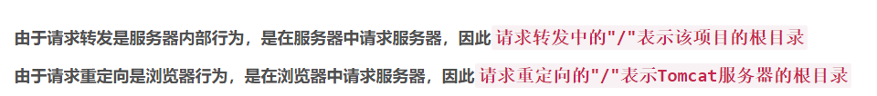
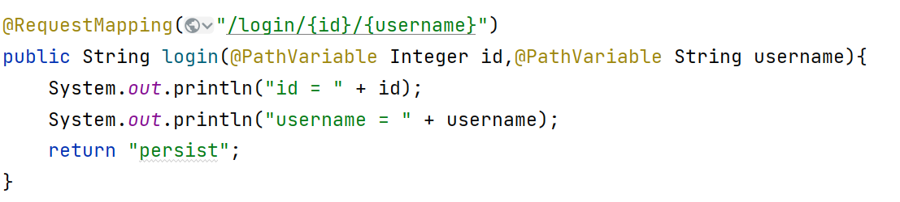

### 第一天
#### servlet的访问路径
> 若是在浏览器中请求服务器，则此时绝对路径的"/"代表的是服务器(Tomcat)的根目录，而此时的相对路径代表的是该项目的根目录  
 若在服务器中请求服务器，则此时绝对路径的"/"或相对路径代表的都是该项目的根目录  
 而在服务器内部，可以这样理解，服务器在解析路径时，‘src’、'webapp’这些文件夹其实都被忽略了，也就是说，这两个目录下的文件可以认为是在同一目录(该项目的根目录)下。  
一定要看使用的是什么路径，如果是相对路径，只需要看目标文件与当前文件之间的位置关系即可，而如果是绝对路径，才需要注意上面这几点要求。  


#### 今天的感想
2022年4月15日00:12:23 加油
今天开始 springmvc的学习 希望能够在周一把  
spring 和 springmvc结束了

--- 
在idea里面什么都能写是吧 你连md文件都给我整好了
居然连图片也能插入 感觉idea真的是神仙
我有钱了一定每年都买 学生果然好
### 第二天

#### Ant风格模糊匹配
在地址栏中的任意 并不包括英文的/ 和 ?因为有歧义
? 代表任意一个值
* 代表任意多个任意值
  /**/两个*b必须一起使用 且前后不能有其他字符 代表任意多个任意目录

#### 路径的占位符

对于 spring 支持 访问路径
比较重要的注解 @PathVariable

1 参数类型必须对应上 否则会404
比如对于 ：
<a th:href="@{/reqMap/login/909/admin}">测试RequestMap对路径占位符支持 : /reqMap/login/909/admin</a>
---
GET "/pro02/reqMap/login/1/admin", parameters={}
结果
id = 1, username = admin
--- 
GET /pro02/reqMap/login/1/
结果
404 
--- 
GET /pro02/reqMap/login/hello/world
结果
404 因为hello不能转化成数字

#### 原生api获取 请求参数的两个重要方法


```java
public class Hello{
  String s =request.getParameter(); //获取一个值
  String[] arr = request.getParameterValues();// 获取多个值
}

```

#### 今日启发
多读源码 里面写的很清楚
比如今天下午 @RequestParam中有三个重要的参数 value() required() defaultValue()  
这个defaultValue上面写的是 
> Whether the parameter is required.  
Defaults to true, leading to an exception being thrown if the parameter is missing in the request. Switch this to false if you prefer a null value if the parameter is not present in the request.
Alternatively, provide a defaultValue, which implicitly sets this flag to false.

这里介绍的就很明白了 如果设置了这个值 required的值就无效了  
#### 需要复习的地方
记得复习 session 和 cookie的关系
把spring的课件整理一下

### 第三天
####
cookie 和 session
老师说 session只于浏览器是否关闭有关系 什么钝化活化
application与服务器是否关闭有关

但是session不是存放于数据库中的吗
