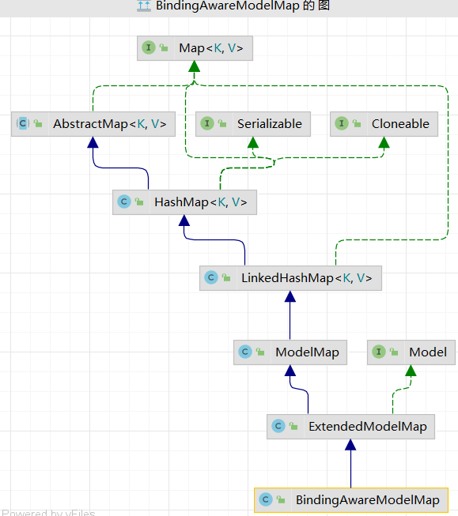

model ,map, modelMap 三个对象的关系

本质上都是BindingAwareModelMap对象
这个类的父类ExtendedModelMap对象 继承了ModelMap
实现了Model接口
而ModelMap继承于 LinkedHashMap因此间接也实现了Map接口

待会来看 ：都是ModelAndView罢了

#### 54 实现delete和put
delete比较麻烦 需要借助与 js
put比较简单 method = "post"
<input="hidden" name="_method" value="PUT">

#### 55 过滤器注意配置顺序

request.setCharacterEncodingType 生效
有一个前提 在这之前不能获取任何一个请求参数
否则失效  
因此 CharacterEncodingFilter必须在
HiddenHttpMethodFilter之前